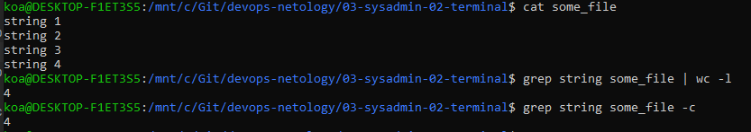
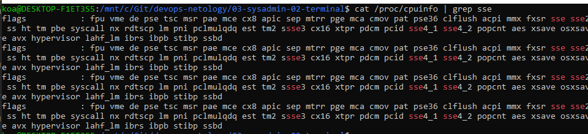

# Домашнее задание к занятию "3.2. Работа в терминале, лекция 2"

1. Какого типа команда `cd`? Попробуйте объяснить, почему она именно такого типа; опишите ход своих мыслей, если считаете что она могла бы быть другого типа.  
```
vagrant@vagrant:~$ type cd
cd is a shell builtin
```
Команда cd встроена в shell. Быстрее отрабатывает, не требует отдельного запуска процесса

4. Какая альтернатива без pipe команде `grep <some_string> <some_file> | wc -l`? `man grep` поможет в ответе на этот вопрос. Ознакомьтесь с [документом](http://www.smallo.ruhr.de/award.html) о других подобных некорректных вариантах использования pipe.  



6. Какой процесс с PID `1` является родителем для всех процессов в вашей виртуальной машине Ubuntu 20.04?  
процесс init


7. Как будет выглядеть команда, которая перенаправит вывод stderr `ls` на другую сессию терминала?  
```
ls sdfsdf 2>/dev/pts/1
```
8. Получится ли одновременно передать команде файл на stdin и вывести ее stdout в другой файл? Приведите работающий пример.  
```
test$ read new_var <file | echo $new_var > file2
```
9. Получится ли находясь в графическом режиме, вывести данные из PTY в какой-либо из эмуляторов TTY? Сможете ли вы наблюдать выводимые данные?  

10. Выполните команду `bash 5>&1`. К чему она приведет? Что будет, если вы выполните `echo netology > /proc/$$/fd/5`? Почему так происходит?  
```
Создаем файловый дескриптор 5 и переназначаем его в stdout. Это приведет к созданию файла 5 в /proc/$$/fd/. Затем stdout команды echo перенаправляем в файл 5.  
В итоге получаем содержимое echo в stdout текущей сессии
```

11. Получится ли в качестве входного потока для pipe использовать только stderr команды, не потеряв при этом отображение stdout на pty? Напоминаем: по умолчанию через pipe передается только stdout команды слева от `|` на stdin команды справа. 
Это можно сделать, поменяв стандартные потоки местами через промежуточный новый дескриптор, который вы научились создавать в предыдущем вопросе.  


9. Что выведет команда `cat /proc/$$/environ`? Как еще можно получить аналогичный по содержанию вывод?  
```
Переменные окружения. Аналогичная команда env
```

10. Используя `man`, опишите что доступно по адресам `/proc/<PID>/cmdline`, `/proc/<PID>/exe`.  
```
cmdline - команда, вызывающая процесс; exe - содержит путь к исполняемой команде процесса
```
11. Узнайте, какую наиболее старшую версию набора инструкций SSE поддерживает ваш процессор с помощью `/proc/cpuinfo`. 
```
sse 4.2
```


12. При открытии нового окна терминала и `vagrant ssh` создается новая сессия и выделяется pty. Это можно подтвердить командой `tty`, которая упоминалась в лекции 3.2. Однако:

     ```bash
     vagrant@netology1:~$ ssh localhost 'tty'
     not a tty
     ```

     Почитайте, почему так происходит, и как изменить поведение.  

13. Бывает, что есть необходимость переместить запущенный процесс из одной сессии в другую. Попробуйте сделать это, воспользовавшись `reptyr`. Например, так можно перенести в `screen` процесс, который вы запустили по ошибке в обычной SSH-сессии.
```
screen -S my_screen
sudo reptyr -T 304123
```
15. `sudo echo string > /root/new_file` не даст выполнить перенаправление под обычным пользователем, так как перенаправлением занимается процесс shell'а, который запущен без `sudo` под вашим пользователем. Для решения данной проблемы можно использовать конструкцию `echo string | sudo tee /root/new_file`. Узнайте что делает команда `tee` и почему в отличие от `sudo echo` команда с `sudo tee` будет работать.
```
tee - считывает из stdin и пишет в stdout/в файл. В случае с tee мы не используем перенаправление, а отдаем на вход данные tee. Tee считывает в пямять и записывает их из под своего процесса
```

 
 