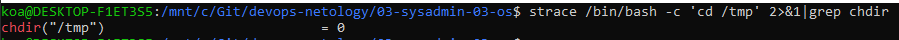
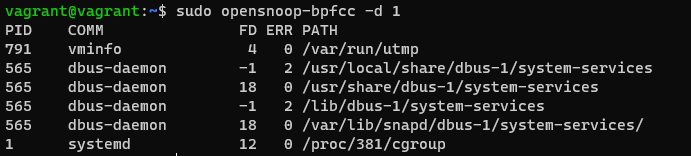
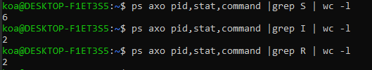
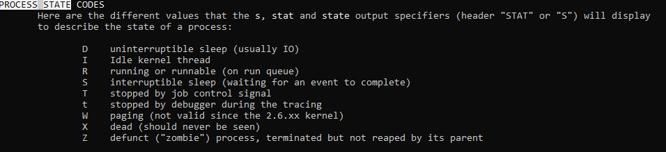

# Домашнее задание к занятию "3.3. Операционные системы, лекция 1"

1. Какой системный вызов делает команда `cd`? В прошлом ДЗ мы выяснили, что `cd` не является самостоятельной  программой, это `shell builtin`, поэтому запустить `strace` непосредственно на `cd` не получится. Тем не менее, вы можете запустить `strace` на `/bin/bash -c 'cd /tmp'`. В этом случае вы увидите полный список системных вызовов, которые делает сам `bash` при старте. Вам нужно найти тот единственный, который относится именно к `cd`. Обратите внимание, что `strace` выдаёт результат своей работы в поток stderr, а не в stdout.
```
strace /bin/bash -c 'cd /tmp' 2>&1|grep chdir
```

2. Попробуйте использовать команду `file` на объекты разных типов на файловой системе. Например:
    ```bash
    vagrant@netology1:~$ file /dev/tty
    /dev/tty: character special (5/0)
    vagrant@netology1:~$ file /dev/sda
    /dev/sda: block special (8/0)
    vagrant@netology1:~$ file /bin/bash
    /bin/bash: ELF 64-bit LSB shared object, x86-64
    ```
    Используя `strace` выясните, где находится база данных `file` на основании которой она делает свои догадки.
```
openat(AT_FDCWD, "/usr/share/misc/magic.mgc", O_RDONLY) = 3
```
3. Предположим, приложение пишет лог в текстовый файл. Этот файл оказался удален (deleted в lsof), однако возможности сигналом сказать приложению переоткрыть файлы или просто перезапустить приложение – нет. Так как приложение продолжает писать в удаленный файл, место на диске постепенно заканчивается. Основываясь на знаниях о перенаправлении потоков предложите способ обнуления открытого удаленного файла (чтобы освободить место на файловой системе).
```
sudo cat /dev/null > file_for_delete (deleted)
```

4.Занимают ли зомби-процессы какие-то ресурсы в ОС (CPU, RAM, IO)?
```
Зомби процесс, это процесс завершивший своё выполнение, но ещё присутствующий в списке процессов.
Ресурсы не занимает.  
```

5. В iovisor BCC есть утилита `opensnoop`:
    ```bash
    root@vagrant:~# dpkg -L bpfcc-tools | grep sbin/opensnoop
    /usr/sbin/opensnoop-bpfcc
    ```
    На какие файлы вы увидели вызовы группы `open` за первую секунду работы утилиты? Воспользуйтесь пакетом `bpfcc-tools` для Ubuntu 20.04. Дополнительные [сведения по установке](https://github.com/iovisor/bcc/blob/master/INSTALL.md).
```
sudo opensnoop-bpfcc -d 1
```

6. Какой системный вызов использует `uname -a`? Приведите цитату из man по этому системному вызову, где описывается альтернативное местоположение в `/proc`, где можно узнать версию ядра и релиз ОС.
```
sudo apt install manpages-dev
man 2 uname 
```

7. Чем отличается последовательность команд через `;` и через `&&` в bash? Например:
    ```bash
    root@netology1:~# test -d /tmp/some_dir; echo Hi
    Hi
    root@netology1:~# test -d /tmp/some_dir && echo Hi
    root@netology1:~#
    ```
    Есть ли смысл использовать в bash `&&`, если применить `set -e`?
```
&& - логическое и, выполняется в случае успешного выполнения первой команды
; - последовательное выполнение команд, не зависит от результата выполнения предыдущей
При использовании set -e разницы в результате использования "&&" и ";" нет, так как при не нулевом ответе происходит выход из скрипта.
```
8. Из каких опций состоит режим bash `set -euxo pipefail` и почему его хорошо было бы использовать в сценариях?
```

set -e - прекращает выполнение скрипта если команда завершилась ошибкой, выводит в stderr строку с ошибкой. Обойти эту проверку можно добавив в пайплайн к команде true: mycommand | true.
set -u - прекращает выполнение скрипта, если встретилась несуществующая переменная.
set -x - выводит выполняемые команды в stdout перед выполненинем.
set -o pipefail прекращает выполнение скрипта, даже если одна из частей пайпа завершилась ошибкой. В этом случае bash-скрипт завершит выполнение, если mycommand вернёт ошибку, не смотря на true в конце пайплайна: mycommand | true.
опции позволяют прсать более безопасные скрипты

```
9. Используя `-o stat` для `ps`, определите, какой наиболее часто встречающийся статус у процессов в системе. В `man ps` ознакомьтесь (`/PROCESS STATE CODES`) что значат дополнительные к основной заглавной буквы статуса процессов. Его можно не учитывать при расчете (считать S, Ss или Ssl равнозначными).

 ```
Больше всего спящих процессов
```


 ```
Не нашел информации о том, что означают дополнительные к основной заглавной буквы статуса процессов
 ```

