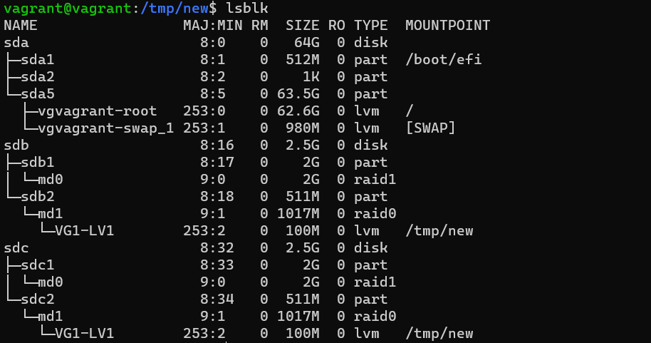

# Домашнее задание к занятию "3.5. Файловые системы"

1. Узнайте о [sparse](https://ru.wikipedia.org/wiki/%D0%A0%D0%B0%D0%B7%D1%80%D0%B5%D0%B6%D1%91%D0%BD%D0%BD%D1%8B%D0%B9_%D1%84%D0%B0%D0%B9%D0%BB) (разряженных) файлах.
``` 
Разрежённый файл (англ. sparse file) — файл, в котором последовательности нулевых байтов[1] заменены на информацию об этих последовательностях (список дыр).

Дыра (англ. hole) — последовательность нулевых байт внутри файла, не записанная на диск. Информация о дырах (смещение от начала файла в байтах и количество байт) хранится в метаданных ФС.
```
1. Могут ли файлы, являющиеся жесткой ссылкой на один объект, иметь разные права доступа и владельца? Почему?
```
Нет, жесткие ссылки имеют такие же права как и объект, в отличии от символических ссылок
```
1. Сделайте `vagrant destroy` на имеющийся инстанс Ubuntu. Замените содержимое Vagrantfile следующим:

    ```bash
    Vagrant.configure("2") do |config|
      config.vm.box = "bento/ubuntu-20.04"
      config.vm.provider :virtualbox do |vb|
        lvm_experiments_disk0_path = "/tmp/lvm_experiments_disk0.vmdk"
        lvm_experiments_disk1_path = "/tmp/lvm_experiments_disk1.vmdk"
        vb.customize ['createmedium', '--filename', lvm_experiments_disk0_path, '--size', 2560]
        vb.customize ['createmedium', '--filename', lvm_experiments_disk1_path, '--size', 2560]
        vb.customize ['storageattach', :id, '--storagectl', 'SATA Controller', '--port', 1, '--device', 0, '--type', 'hdd', '--medium', lvm_experiments_disk0_path]
        vb.customize ['storageattach', :id, '--storagectl', 'SATA Controller', '--port', 2, '--device', 0, '--type', 'hdd', '--medium', lvm_experiments_disk1_path]
      end
    end
    ```

    Данная конфигурация создаст новую виртуальную машину с двумя дополнительными неразмеченными дисками по 2.5 Гб.
``` 
Создал новую ВМ с предложенным конфигом.
nano vagrantfile   
vagrant up   
vagrant ssh   
```
1. Используя `fdisk`, разбейте первый диск на 2 раздела: 2 Гб, оставшееся пространство.
``` 
sudo fdisk -l
sudo fdisk /dev/sdb

Welcome to fdisk (util-linux 2.34).
Changes will remain in memory only, until you decide to write them.
Be careful before using the write command.

Device does not contain a recognized partition table.
Created a new DOS disklabel with disk identifier 0x14c16d54.

Command (m for help): g
Created a new GPT disklabel (GUID: D0EDC5A6-2C14-B744-B91F-3999EC328CD4).

Command (m for help): n
Partition number (1-128, default 1): 1
First sector (2048-5242846, default 2048): 2048
Last sector, +/-sectors or +/-size{K,M,G,T,P} (2048-5242846, default 5242846): +2G

Created a new partition 1 of type 'Linux filesystem' and of size 2 GiB.

Command (m for help): n
Partition number (2-128, default 2): 2
First sector (4196352-5242846, default 4196352):
Last sector, +/-sectors or +/-size{K,M,G,T,P} (4196352-5242846, default 5242846):

Created a new partition 2 of type 'Linux filesystem' and of size 511 MiB.

Command (m for help): p
Disk /dev/sdb: 2.51 GiB, 2684354560 bytes, 5242880 sectors
Disk model: VBOX HARDDISK
Units: sectors of 1 * 512 = 512 bytes
Sector size (logical/physical): 512 bytes / 512 bytes
I/O size (minimum/optimal): 512 bytes / 512 bytes
Disklabel type: gpt
Disk identifier: D0EDC5A6-2C14-B744-B91F-3999EC328CD4

Device       Start     End Sectors  Size Type
/dev/sdb1     2048 4196351 4194304    2G Linux filesystem
/dev/sdb2  4196352 5242846 1046495  511M Linux filesystem

Command (m for help): w
The partition table has been altered.
Calling ioctl() to re-read partition table.
Syncing disks.

vagrant@vagrant:~$ lsblk | egrep 'NAME|sdb'
NAME                 MAJ:MIN RM  SIZE RO TYPE MOUNTPOINT
sdb                    8:16   0  2.5G  0 disk
├─sdb1                 8:17   0    2G  0 part
└─sdb2                 8:18   0  511M  0 part
```
1. Используя `sfdisk`, перенесите данную таблицу разделов на второй диск.
``` 
sudo sfdisk -d /dev/sdb | sudo sfdisk /dev/sdc
Checking that no-one is using this disk right now ... OK

Disk /dev/sdc: 2.51 GiB, 2684354560 bytes, 5242880 sectors
Disk model: VBOX HARDDISK
Units: sectors of 1 * 512 = 512 bytes
Sector size (logical/physical): 512 bytes / 512 bytes
I/O size (minimum/optimal): 512 bytes / 512 bytes

>>> Script header accepted.
>>> Script header accepted.
>>> Script header accepted.
>>> Script header accepted.
>>> Script header accepted.
>>> Script header accepted.
>>> Created a new GPT disklabel (GUID: D0EDC5A6-2C14-B744-B91F-3999EC328CD4).
/dev/sdc1: Created a new partition 1 of type 'Linux filesystem' and of size 2 GiB.
/dev/sdc2: Created a new partition 2 of type 'Linux filesystem' and of size 511 MiB.
/dev/sdc3: Done.

New situation:
Disklabel type: gpt
Disk identifier: D0EDC5A6-2C14-B744-B91F-3999EC328CD4
sfdisk: gpt unknown column: rce 
```
1. Соберите `mdadm` RAID1 на паре разделов 2 Гб.
``` 
sudo mdadm --create --verbose /dev/md0 --level=1 --raid-devices=2 /dev/sdb1 /dev/sdc1
mdadm: Note: this array has metadata at the start and
    may not be suitable as a boot device.  If you plan to
    store '/boot' on this device please ensure that
    your boot-loader understands md/v1.x metadata, or use
    --metadata=0.90
mdadm: size set to 2094080K
Continue creating array? y
mdadm: Defaulting to version 1.2 metadata
mdadm: array /dev/md0 started.
```
1. Соберите `mdadm` RAID0 на второй паре маленьких разделов.
``` 
sudo mdadm --create --verbose /dev/md1 --level=0 --raid-devices=2 /dev/sdb2 /dev/sdc2
mdadm: chunk size defaults to 512K
mdadm: Defaulting to version 1.2 metadata
mdadm: array /dev/md1 started.
```
1. Создайте 2 независимых PV на получившихся md-устройствах.
``` 
sudo pvcreate /dev/md0
  Physical volume "/dev/md0" successfully created.
sudo pvcreate /dev/md1
  Physical volume "/dev/md1" successfully created.
sudo pvdisplay
  --- Physical volume ---
  PV Name               /dev/sda5
  VG Name               vgvagrant
  PV Size               <63.50 GiB / not usable 0
  Allocatable           yes (but full)
  PE Size               4.00 MiB
  Total PE              16255
  Free PE               0
  Allocated PE          16255
  PV UUID               Mx3LcA-uMnN-h9yB-gC2w-qm7w-skx0-OsTz9z

  "/dev/md0" is a new physical volume of "<2.00 GiB"
  --- NEW Physical volume ---
  PV Name               /dev/md0
  VG Name
  PV Size               <2.00 GiB
  Allocatable           NO
  PE Size               0
  Total PE              0
  Free PE               0
  Allocated PE          0
  PV UUID               QL95lc-dUhp-UDDC-78lN-8RGn-neHl-kWlVcw

  "/dev/md1" is a new physical volume of "1017.00 MiB"
  --- NEW Physical volume ---
  PV Name               /dev/md1
  VG Name
  PV Size               1017.00 MiB
  Allocatable           NO
  PE Size               0
  Total PE              0
  Free PE               0
  Allocated PE          0
  PV UUID               8V8zhh-8dcT-JM66-rZuq-8vYt-IcE0-dZYy8x
```
1. Создайте общую volume-group на этих двух PV.
``` 
sudo vgcreate VG1 /dev/md0 /dev/md1
  Volume group "VG1" successfully created
sudo vgdisplay
  --- Volume group ---
  VG Name               vgvagrant
  System ID
  Format                lvm2
  Metadata Areas        1
  Metadata Sequence No  3
  VG Access             read/write
  VG Status             resizable
  MAX LV                0
  Cur LV                2
  Open LV               2
  Max PV                0
  Cur PV                1
  Act PV                1
  VG Size               <63.50 GiB
  PE Size               4.00 MiB
  Total PE              16255
  Alloc PE / Size       16255 / <63.50 GiB
  Free  PE / Size       0 / 0
  VG UUID               PaBfZ0-3I0c-iIdl-uXKt-JL4K-f4tT-kzfcyE

  --- Volume group ---
  VG Name               VG1
  System ID
  Format                lvm2
  Metadata Areas        2
  Metadata Sequence No  1
  VG Access             read/write
  VG Status             resizable
  MAX LV                0
  Cur LV                0
  Open LV               0
  Max PV                0
  Cur PV                2
  Act PV                2
  VG Size               <2.99 GiB
  PE Size               4.00 MiB
  Total PE              765
  Alloc PE / Size       0 / 0
  Free  PE / Size       765 / <2.99 GiB
  VG UUID               ZZdKUn-Ldlp-PsDQ-m0Wo-qmjc-AEEg-RWW43U
```
1. Создайте LV размером 100 Мб, указав его расположение на PV с RAID0.
``` 
sudo lvcreate -L 100M -n LV1 VG1 /dev/md1
  Logical volume "LV1" created.
sudo lvdisplay
  --- Logical volume ---
  LV Path                /dev/vgvagrant/root
  LV Name                root
  VG Name                vgvagrant
  LV UUID                ybvP3g-N4gJ-FMMr-WfRk-Ermg-cftw-In20VW
  LV Write Access        read/write
  LV Creation host, time vagrant, 2021-07-28 17:45:53 +0000
  LV Status              available
  # open                 1
  LV Size                <62.54 GiB
  Current LE             16010
  Segments               1
  Allocation             inherit
  Read ahead sectors     auto
  - currently set to     256
  Block device           253:0

  --- Logical volume ---
  LV Path                /dev/vgvagrant/swap_1
  LV Name                swap_1
  VG Name                vgvagrant
  LV UUID                GoQVTk-fU79-pbTZ-vX0W-9DbL-p7OI-XCSHPj
  LV Write Access        read/write
  LV Creation host, time vagrant, 2021-07-28 17:45:53 +0000
  LV Status              available
  # open                 2
  LV Size                980.00 MiB
  Current LE             245
  Segments               1
  Allocation             inherit
  Read ahead sectors     auto
  - currently set to     256
  Block device           253:1

  --- Logical volume ---
  LV Path                /dev/VG1/LV1
  LV Name                LV1
  VG Name                VG1
  LV UUID                bnVuvk-CNpH-heII-ywBH-D2bc-6fZe-pd3WOZ
  LV Write Access        read/write
  LV Creation host, time vagrant, 2022-01-22 15:46:55 +0000
  LV Status              available
  # open                 0
  LV Size                100.00 MiB
  Current LE             25
  Segments               1
  Allocation             inherit
  Read ahead sectors     auto
  - currently set to     4096
  Block device           253:2

```
1. Создайте `mkfs.ext4` ФС на получившемся LV.
``` 
sudo mkfs.ext4 /dev/VG1/LV1
mke2fs 1.45.5 (07-Jan-2020)
Creating filesystem with 25600 4k blocks and 25600 inodes

Allocating group tables: done
Writing inode tables: done
Creating journal (1024 blocks): done
Writing superblocks and filesystem accounting information: done
```
1. Смонтируйте этот раздел в любую директорию, например, `/tmp/new`.
``` 
mkdir /tmp/new
sudo mount /dev/VG1/LV1 /tmp/new
```
1. Поместите туда тестовый файл, например `wget https://mirror.yandex.ru/ubuntu/ls-lR.gz -O /tmp/new/test.gz`.
``` 
Изучил статью 
```
1. Прикрепите вывод `lsblk`.

1. Протестируйте целостность файла:

    ```bash
    root@vagrant:~# gzip -t /tmp/new/test.gz
    root@vagrant:~# echo $?
    0
    ```
```    
gzip -t /tmp/new/test.gz
echo $?
0
``` 
1. Используя pvmove, переместите содержимое PV с RAID0 на RAID1.
``` 
sudo pvmove /dev/md1 /dev/md0
  /dev/md1: Moved: 16.00%
  /dev/md1: Moved: 100.00%
  
lsblk
NAME                 MAJ:MIN RM  SIZE RO TYPE  MOUNTPOINT
sda                    8:0    0   64G  0 disk
├─sda1                 8:1    0  512M  0 part  /boot/efi
├─sda2                 8:2    0    1K  0 part
└─sda5                 8:5    0 63.5G  0 part
  ├─vgvagrant-root   253:0    0 62.6G  0 lvm   /
  └─vgvagrant-swap_1 253:1    0  980M  0 lvm   [SWAP]
sdb                    8:16   0  2.5G  0 disk
├─sdb1                 8:17   0    2G  0 part
│ └─md0                9:0    0    2G  0 raid1
│   └─VG1-LV1        253:2    0  100M  0 lvm   /tmp/new
└─sdb2                 8:18   0  511M  0 part
  └─md1                9:1    0 1017M  0 raid0
sdc                    8:32   0  2.5G  0 disk
├─sdc1                 8:33   0    2G  0 part
│ └─md0                9:0    0    2G  0 raid1
│   └─VG1-LV1        253:2    0  100M  0 lvm   /tmp/new
└─sdc2                 8:34   0  511M  0 part
  └─md1                9:1    0 1017M  0 raid0
```
1. Сделайте `--fail` на устройство в вашем RAID1 md.
``` 
mdadm --fail /dev/md0 /dev/sdb1
mdadm: set /dev/sdb1 faulty in /dev/md0
```
1. Подтвердите выводом `dmesg`, что RAID1 работает в деградированном состоянии.
``` 
dmesg -T | grep raid
..
[Sun Jan 23 05:44:40 2022] md/raid1:md0: Disk failure on sdb1, disabling device.
                           md/raid1:md0: Operation continuing on 1 devices.
```
1. Протестируйте целостность файла, несмотря на "сбойный" диск он должен продолжать быть доступен:

    ```bash
    root@vagrant:~# gzip -t /tmp/new/test.gz
    root@vagrant:~# echo $?
    0
    ```
``` 
gzip -t /tmp/new/test.gz
echo $?
0
```
1. Погасите тестовый хост, `vagrant destroy`.
``` 
vagrant destroy
    default: Are you sure you want to destroy the 'default' VM? [y/N] y
==> default: Forcing shutdown of VM...
==> default: Destroying VM and associated drives...
```
 
