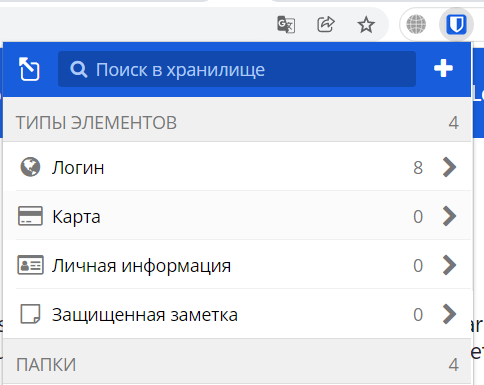
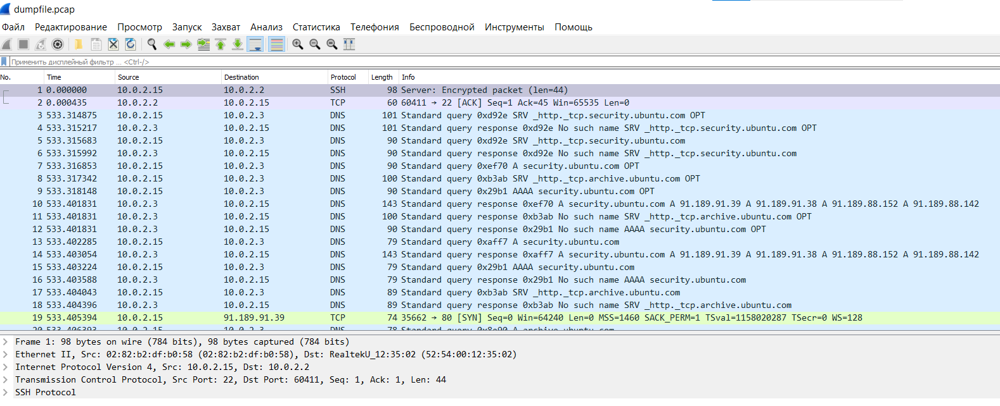

# Домашнее задание к занятию "3.9. Элементы безопасности информационных систем"

1. Установите Bitwarden плагин для браузера. Зарегестрируйтесь и сохраните несколько паролей.

2. Установите Google authenticator на мобильный телефон. Настройте вход в Bitwarden акаунт через Google authenticator OTP.
```
Использую приложенгие Authy на мобильном телефоне для полцчения динамических кодов подтверждения
```
3. Установите apache2, сгенерируйте самоподписанный сертификат, настройте тестовый сайт для работы по HTTPS.
```
sudo apt update
sudo apt install apache2
sudo a2enmod ssl
sudo systemctl restart apache2
sudo openssl req -x509 -nodes -days 365 -newkey rsa:2048 \
-keyout /etc/ssl/private/apache-selfsigned.key \
-out /etc/ssl/certs/apache-selfsigned.crt \
-subj "/C=RU/ST=Moscow/L=Moscow/O=Company Name/OU=Org/CN=test.com"
Generating a RSA private key
..........................................................................................+++++
...+++++
writing new private key to '/etc/ssl/private/apache-selfsigned.key'
-----
sudo nano /etc/apache2/sites-available/test.com.conf
sudo mkdir /var/www/test
sudo nano /var/www/test/index.html
sudo a2ensite test.com.conf
sudo apache2ctl configtest
sudo systemctl reload apache2
curl https://test.com
```
4. Проверьте на TLS уязвимости произвольный сайт в интернете (кроме сайтов МВД, ФСБ, МинОбр, НацБанк, РосКосмос, РосАтом, РосНАНО и любых госкомпаний, объектов КИИ, ВПК ... и тому подобное).
```
 git clone --depth 1 https://github.com/drwetter/testssl.sh.git
Cloning into 'testssl.sh'...
remote: Enumerating objects: 100, done.
remote: Counting objects: 100% (100/100), done.
remote: Compressing objects: 100% (93/93), done.
remote: Total 100 (delta 14), reused 25 (delta 6), pack-reused 0
Receiving objects: 100% (100/100), 8.61 MiB | 237.00 KiB/s, done.
Resolving deltas: 100% (14/14), done.

cd testssl.sh
./testssl.sh -U --sneaky https://www.ya.ru/

###########################################################
    testssl.sh       3.1dev from https://testssl.sh/dev/
    (93e3b49 2022-01-24 18:05:12 -- )

      This program is free software. Distribution and
             modification under GPLv2 permitted.
      USAGE w/o ANY WARRANTY. USE IT AT YOUR OWN RISK!

       Please file bugs @ https://testssl.sh/bugs/

###########################################################

 Using "OpenSSL 1.0.2-chacha (1.0.2k-dev)" [~183 ciphers]
 on ubuntu-hirsute:./bin/openssl.Linux.x86_64
 (built: "Jan 18 17:12:17 2019", platform: "linux-x86_64")


 Start 2022-01-24 18:28:15        -->> 87.250.250.242:443 (www.ya.ru) <<--

 rDNS (87.250.250.242):  ya.ru.
 Service detected:       HTTP


 Testing vulnerabilities

 Heartbleed (CVE-2014-0160)                not vulnerable (OK), no heartbeat extension
 CCS (CVE-2014-0224)                       not vulnerable (OK)
 Ticketbleed (CVE-2016-9244), experiment.  not vulnerable (OK), reply empty
 ROBOT                                     VULNERABLE (NOT ok) - weakly vulnerable as the attack would take too long
 Secure Renegotiation (RFC 5746)           supported (OK)
 Secure Client-Initiated Renegotiation     not vulnerable (OK)
 CRIME, TLS (CVE-2012-4929)                not vulnerable (OK)
 BREACH (CVE-2013-3587)                    no gzip/deflate/compress/br HTTP compression (OK)  - only supplied "/" tested
 POODLE, SSL (CVE-2014-3566)               not vulnerable (OK)
 TLS_FALLBACK_SCSV (RFC 7507)              Check failed, unexpected result , run testssl.sh -Z --debug=1 and look at /tmp/testssl.w8uiy6/*tls_fallback_scsv.txt
 SWEET32 (CVE-2016-2183, CVE-2016-6329)    VULNERABLE, uses 64 bit block ciphers
 FREAK (CVE-2015-0204)                     not vulnerable (OK)
 DROWN (CVE-2016-0800, CVE-2016-0703)      not vulnerable on this host and port (OK)
                                           make sure you don't use this certificate elsewhere with SSLv2 enabled services
                                           https://censys.io/ipv4?q=26EB381642B07A05F7CA935101FC6492F91F7F0721995A8E577EDFB6723EBD1F could help you to find out
 LOGJAM (CVE-2015-4000), experimental      not vulnerable (OK): no DH EXPORT ciphers, no DH key detected with <= TLS 1.2
 BEAST (CVE-2011-3389)                     TLS1: ECDHE-RSA-AES128-SHA AES128-SHA DES-CBC3-SHA
                                           VULNERABLE -- but also supports higher protocols  TLSv1.1 TLSv1.2 (likely mitigated)
 LUCKY13 (CVE-2013-0169), experimental     potentially VULNERABLE, uses cipher block chaining (CBC) ciphers with TLS. Check patches
 Winshock (CVE-2014-6321), experimental    not vulnerable (OK)
 RC4 (CVE-2013-2566, CVE-2015-2808)        no RC4 ciphers detected (OK)


 Done 2022-01-24 18:28:39 [  28s] -->> 87.250.250.242:443 (www.ya.ru) <<--

```
5. Установите на Ubuntu ssh сервер, сгенерируйте новый приватный ключ. Скопируйте свой публичный ключ на другой сервер. Подключитесь к серверу по SSH-ключу.
``` 
ssh-keygen
cat ~/.ssh/id_rsa.pub
ssh -T git@github.com
Hi OKryuchenko! You've successfully authenticated, but GitHub does not provide shell access.
``` 
6. Переименуйте файлы ключей из задания 5. Настройте файл конфигурации SSH клиента, так чтобы вход на удаленный сервер осуществлялся по имени сервера.
```
mv ~/.ssh/id_rsa ~/.ssh/id_rsa_git
nano ~/.ssh/config
    HostName github.com
    IdentityFile ~/.ssh/id_rsa_git
    User git
ssh githab
PTY allocation request failed on channel 0
Hi OKryuchenko! You've successfully authenticated, but GitHub does not provide shell access.
Connection to github.com closed.
```
7. Соберите дамп трафика утилитой tcpdump в формате pcap, 100 пакетов. Откройте файл pcap в Wireshark.
```
sudo apt install tcpdump
sudo tcpdump -c 100 -w dumpfile.pcap
    tcpdump: listening on enp0s3, link-type EN10MB (Ethernet), capture size 262144 bytes
    100 packets captured
    239 packets received by filter
    0 packets dropped by kernel

```

 ---
## Задание для самостоятельной отработки (необязательно к выполнению)

8*. Просканируйте хост scanme.nmap.org. Какие сервисы запущены?

9*. Установите и настройте фаервол ufw на web-сервер из задания 3. Откройте доступ снаружи только к портам 22,80,443
