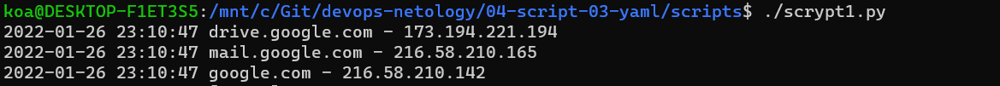
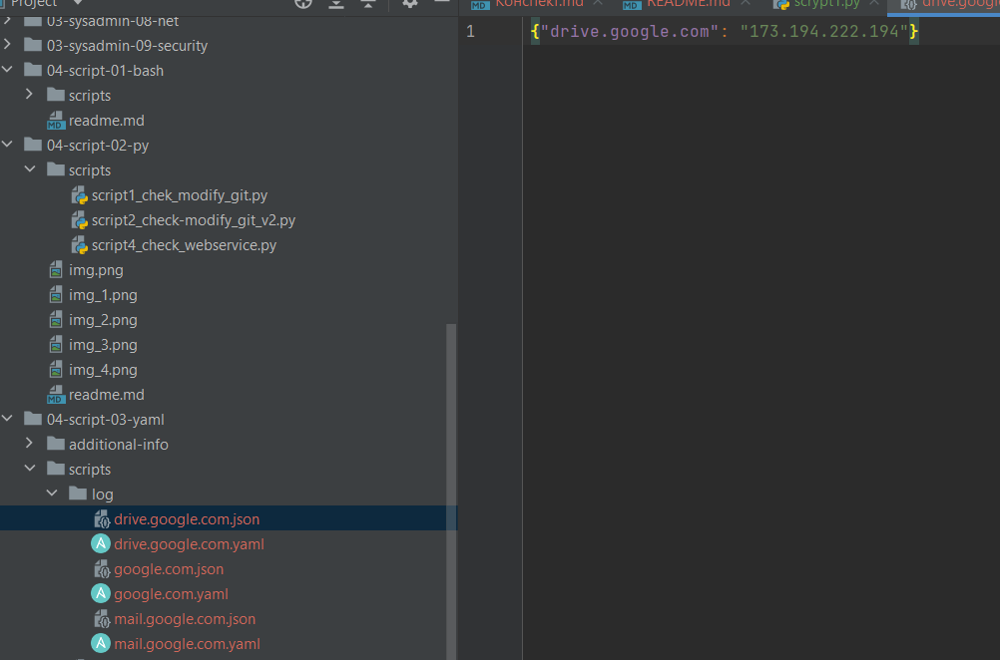

# Домашнее задание к занятию "4.3. Языки разметки JSON и YAML"

## Обязательные задания

1. Мы выгрузили JSON, который получили через API запрос к нашему сервису:
	```json
    { "info" : "Sample JSON output from our service\t",
        "elements" :[
            { "name" : "first",
            "type" : "server",
            "ip" : 7175 
            },
            { "name" : "second",
            "type" : "proxy",
            "ip : 71.78.22.43
            }
        ]
    }
	```
  Нужно найти и исправить все ошибки, которые допускает наш сервис
```
    { "info" : "Sample JSON output from our service\t",
        "elements" : [
            { "name" : "first",
            "type" : "server",
            "ip" : "7175"
            },
            { "name" : "second",
            "type" : "proxy",
            "ip" : "71.78.22.43"
            }
        ]
    }
```
2. В прошлый рабочий день мы создавали скрипт, позволяющий опрашивать веб-сервисы и получать их IP. К уже реализованному функционалу нам нужно добавить возможность записи JSON и YAML файлов, описывающих наши сервисы. Формат записи JSON по одному сервису: { "имя сервиса" : "его IP"}. Формат записи YAML по одному сервису: - имя сервиса: его IP. Если в момент исполнения скрипта меняется IP у сервиса - он должен так же поменяться в yml и json файле.
```python 
#!/usr/bin/env python3
import datetime
import socket
import time
import json
import yaml
import os

cdlog = os.getcwd() + "/log/"
hosts = {'drive.google.com':'0.0.0.0','mail.google.com':'0.0.0.0','google.com':'0.0.0.0'}
while True:
    for host in hosts:
        error = False
        ip = socket.gethostbyname(host)
        oldip = hosts[host]
        d = datetime.datetime.now()
        if oldip == '0.0.0.0':
            hosts[host] = ip
        elif ip != oldip:
            error = True
        if error:
            print(d.strftime('%Y-%m-%d %H:%M:%S') + ' [ERROR] ' + host + ' IP mismatch: ' + oldip + ' ' + ip)
        else:
            print(d.strftime('%Y-%m-%d %H:%M:%S') + ' ' + host + ' - ' + ip)
        with open(cdlog + host + ".json", 'w') as jsf:
            json_data = json.dumps({host: ip})
            jsf.write(json_data)
        with open(cdlog + host + ".yaml", 'w') as ymf:
            yaml_data = yaml.dump([{host: ip}])
            ymf.write(yaml_data)
    time.sleep(10)
```



## Дополнительное задание (со звездочкой*) - необязательно к выполнению

Так как команды в нашей компании никак не могут прийти к единому мнению о том, какой формат разметки данных использовать: JSON или YAML, нам нужно реализовать парсер из одного формата в другой. Он должен уметь:
   * Принимать на вход имя файла
   * Проверять формат исходного файла. Если файл не json или yml - скрипт должен остановить свою работу
   * Распознавать какой формат данных в файле. Считается, что файлы *.json и *.yml могут быть перепутаны
   * Перекодировать данные из исходного формата во второй доступный (из JSON в YAML, из YAML в JSON)
   * При обнаружении ошибки в исходном файле - указать в стандартном выводе строку с ошибкой синтаксиса и её номер
   * Полученный файл должен иметь имя исходного файла, разница в наименовании обеспечивается разницей расширения файлов

---

### Как сдавать задания

Выполненное домашнее задание пришлите ссылкой на .md-файл в вашем репозитории.

---
