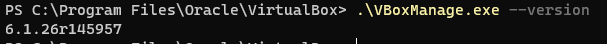
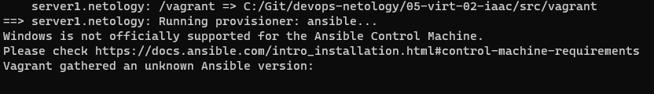

# Домашнее задание к занятию "5.2. Применение принципов IaaC в работе с виртуальными машинами"

## Как сдавать задания

Обязательными к выполнению являются задачи без указания звездочки. Их выполнение необходимо для получения зачета и диплома о профессиональной переподготовке.

Задачи со звездочкой (*) являются дополнительными задачами и/или задачами повышенной сложности. Они не являются обязательными к выполнению, но помогут вам глубже понять тему.

Домашнее задание выполните в файле readme.md в github репозитории. В личном кабинете отправьте на проверку ссылку на .md-файл в вашем репозитории.

Любые вопросы по решению задач задавайте в чате учебной группы.

---

## Задача 1

- Опишите своими словами основные преимущества применения на практике IaaC паттернов.
Предсказуемость
Легче автоматизировать разворачивание инфраструктуру. Возможность тиражирования

- Какой из принципов IaaC является основополагающим?

Идемпотентность -  Возможность получать идентичный результат при повторном разворачивании инфраструктуры.

## Задача 2

- Чем Ansible выгодно отличается от других систем управление конфигурациями?

    Основное преимущества использование SSH инфраструктуры без установки дополнительных утилит, а также наличие большого количества модулей.

- Какой, на ваш взгляд, метод работы систем конфигурации более надёжный push или pull?
Зависит от задачи.
Наверно push более удобен, т.к. не требует установки агента на удаленные сервера
## Задача 3

Установить на личный компьютер:

- VirtualBox
- Vagrant
- Ansible

*Приложить вывод команд установленных версий каждой из программ, оформленный в markdown.*
Установка Ansible 

    sudo apt install software-properties-common
    sudo add-apt-repository --yes --update ppa:ansible/ansible
    sudo apt install ansible


VirtualBox



## Задача 4 (*)

Воспроизвести практическую часть лекции самостоятельно.

- Создать виртуальную машину.
- Зайти внутрь ВМ, убедиться, что Docker установлен с помощью команды
```
docker ps
```
Не понимаю как заставить работать Ansible из под Windows.
Windows он не поддерживается, а WSL  не работает с VirtualBox.

Возможно удастся установить Ubuntu  в Hyper-v, он поддерживает вложеную виртуализацию.
Подскажите, как организовать работу Ansible под Windows

