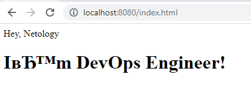
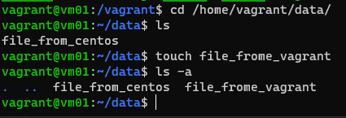

# Домашнее задание к занятию "5.3. Введение. Экосистема. Архитектура. Жизненный цикл Docker контейнера"
---
## Задача 1
Сценарий выполения задачи:
- создайте свой репозиторий на https://hub.docker.com;
- выберете любой образ, который содержит веб-сервер Nginx;
- создайте свой fork образа;
- реализуйте функциональность:
запуск веб-сервера в фоне с индекс-страницей, содержащей HTML-код ниже:
```
<html>
<head>
Hey, Netology
</head>
<body>
<h1> I’m DevOps Engineer!</h1>
</body>
</html>
```
Опубликуйте созданный форк в своем репозитории и предоставьте ответ в виде ссылки на https://hub.docker.com/username_repo.
получение образа 
>sudo docker pull ubuntu/nginx:1.18-20.04_beta

запуск контейнера
>sudo docker run -d --name nginx-cont -e TZ=UTC -p 8080:80 ubuntu/nginx:1.18-20.04_beta

Остановка контейнера
>sudo docker stop 48d24c7043e7

Запуск контейнера

>sudo docker start 48d24c7043e7

Сборка контейнера с подключением локальной дирриктории содержащей сайт

> sudo docker run -v /home/vagrant/html:/var/www/html -d --name nginx-whith-html3 -e TZ=UTC -p 8080:80 ubuntu/nginx:1.18-20.04_beta 


## Задача 2

Посмотрите на сценарий ниже и ответьте на вопрос:
"Подходит ли в этом сценарии использование Docker контейнеров или лучше подойдет виртуальная машина, физическая машина? Может быть возможны разные варианты?"

Детально опишите и обоснуйте свой выбор.

--

Сценарий:

- Высоконагруженное монолитное java веб-приложение;
>лучше подойдет кластер виртуальны машин
- Nodejs веб-приложение;
>возможно использование контейнеров
- Мобильное приложение c версиями для Android и iOS;
>возможно использование контейнеров
- Шина данных на базе Apache Kafka;
>затрудняюсь ответить, не знаком с технологией
- Elasticsearch кластер для реализации логирования продуктивного веб-приложения - три ноды elasticsearch, два logstash и две ноды kibana;
>лучше подойдет кластер виртуальны машин
- Мониторинг-стек на базе Prometheus и Grafana;
>возможно использование контейнеров
- MongoDB, как основное хранилище данных для java-приложения;
>в контейнерах данные не хранятся, нет смыслы в их использовании
- Gitlab сервер для реализации CI/CD процессов и приватный (закрытый) Docker Registry.
>>возможно использование контейнеров

## Задача 3

- Запустите первый контейнер из образа ***centos*** c любым тэгом в фоновом режиме, подключив папку ```/data``` из текущей рабочей директории на хостовой машине в ```/data``` контейнера;
> sudo docker build -t okryuchenko/centos7:001 .
> sudo docker run -d --name centos7-001-v1 -e TZ=UTC okryuchenko/centos7:001
> sudo docker run -v /home/vagrant/data:/home/data -d --name centos7-001-v2 -e TZ=UTC okryuchenko/centos7:001
- Запустите второй контейнер из образа ***debian*** в фоновом режиме, подключив папку ```/data``` из текущей рабочей директории на хостовой машине в ```/data``` контейнера;
>sudo docker build -t okryuchenko/debian:v777 .
> sudo docker run -v /home/vagrant/data:/home/data --name debian-v777 -d -e TZ=UTC okryuchenko/debian:v777

- Подключитесь к первому контейнеру с помощью ```docker exec``` и создайте текстовый файл любого содержания в ```/data```;
>vagrant@vm01:/vagrant/debian$ sudo docker exec -it 15e40345c585 bash
>[root@15e40345c585 /]# cd home/data/
>[root@15e40345c585 data]# touch file_from_centos
- Добавьте еще один файл в папку ```/data``` на хостовой машине;

- Подключитесь во второй контейнер и отобразите листинг и содержание файлов в ```/data``` контейнера.
>не удалось запустить контейнер с debian
## Задача 4 (*)

Воспроизвести практическую часть лекции самостоятельно.

Соберите Docker образ с Ansible, загрузите на Docker Hub и пришлите ссылку вместе с остальными ответами к задачам.

>https://hub.docker.com/repository/registry-1.docker.io/okryuchenko/ansible/tags?page=1&ordering=last_updated

---

### Как cдавать задание

Выполненное домашнее задание пришлите ссылкой на .md-файл в вашем репозитории.

---
