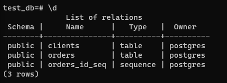
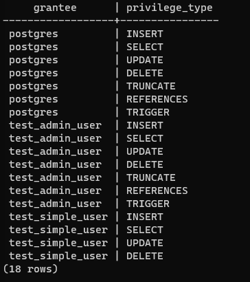
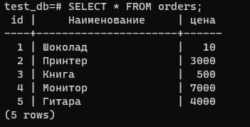

# Домашнее задание к занятию "6.2. SQL"

## Введение

Перед выполнением задания вы можете ознакомиться с 
[дополнительными материалами](https://github.com/netology-code/virt-homeworks/tree/master/additional/README.md).

## Задача 1

Используя docker поднимите инстанс PostgreSQL (версию 12) c 2 volume, 
в который будут складываться данные БД и бэкапы.

Приведите получившуюся команду или docker-compose манифест.

```
sversion: "3.9"
services:
  postgres:
    image: postgres:12
    environment:
      POSTGRES_DB: "test_db"
      POSTGRES_USER: "postgres"
      POSTGRES_PASSWORD: "postgres"
      PGDATA: "/var/lib/postgresql/data/pgdata"
    volumes:
      - ../2. Init Database:/docker-entrypoint-initdb.d
      - .:/var/lib/postgresql/data
    ports:
      - "5432:5432"
```

sudo docker-compose up -d 
sudo docker exec -it src_postgres_1 bash

При попытке запуска psql получил ошибку


решение, запуск от пользователя   
psql -U postgres

## Задача 2

В БД из задачи 1: 
- создайте пользователя test-admin-user и БД test_db
CREATE DATABASE test_db;
CREATE USER test_admin_user;
- в БД test_db создайте таблицу orders и clients (спeцификация таблиц ниже)
```
CREATE TABLE orders (
    id  SERIAL PRIMARY KEY,
    Наименование char(20),
    цена INTEGER
   );
```
```
test_db=# CREATE TABLE clients
(
        id BIGSERIAL,
        name VARCHAR(50),
        country VARCHAR(50),
        order_id INT,
        foreign key (order_id) REFERENCES orders (id)
);
```

CREATE TABLE clients
(
        id BIGSERIAL,
        name VARCHAR(50),
        country VARCHAR(50),
        order_id INT,
        foreign key (order_id) REFERENCES orders (id)
);


- предоставьте привилегии на все операции пользователю test-admin-user на таблицы БД test_db
>GRANT ALL ON DATABASE test_db TO test_admin_user;
- создайте пользователя test-simple-user 
>CREATE USER test_simple_user;
- предоставьте пользователю test-simple-user права на SELECT/INSERT/UPDATE/DELETE данных таблиц БД test_db

При попытке присвоить необходимые права для базы данных 
>GRANT SELECT, INSERT, UPDATE, DELETE ON DATABASE test_db TO test_simple_user;

получил ошибку
ERROR:  invalid privilege type SELECT for database

Решение: присвоить права таблицам по отдельности:

>GRANT SELECT, INSERT, UPDATE, DELETE ON clients TO test_simple_user;  
GRANT SELECT, INSERT, UPDATE, DELETE ON orders TO test_simple_user;


Таблица orders:
- id (serial primary key)
- наименование (string)
- цена (integer)

Таблица clients:
- id (serial primary key)
- фамилия (string)
- страна проживания (string, index)
- заказ (foreign key orders)

Приведите:
- итоговый список БД после выполнения пунктов выше,

>\d


- описание таблиц (describe)
>\dd   


- SQL-запрос для выдачи списка пользователей с правами над таблицами test_db
```
test_db=# SELECT grantee, privilege_type
test_db-# FROM information_schema.role_table_grants
test_db-# WHERE table_name='clients'
test_db-# ;
```
- список пользователей с правами над таблицами test_db   

## Задача 3

Используя SQL синтаксис - наполните таблицы следующими тестовыми данными:

Таблица orders

|Наименование|цена|
|------------|----|
|Шоколад| 10 |
|Принтер| 3000 |
|Книга| 500 |
|Монитор| 7000|
|Гитара| 4000|

INSERT INTO orders (Наименование, цена) VALUES('Шоколад', '10');
INSERT INTO orders (Наименование, цена) VALUES('Принтер', '3000');
INSERT INTO orders (Наименование, цена) VALUES('Книга', '500');
INSERT INTO orders (Наименование, цена) VALUES('Монитор', '7000');
INSERT INTO orders (Наименование, цена) VALUES('Гитара', '4000');

>SELECT * FROM orders;


Таблица clients

|ФИО|Страна проживания|
|------------|----|
|Иванов Иван Иванович| USA |
|Петров Петр Петрович| Canada |
|Иоганн Себастьян Бах| Japan |
|Ронни Джеймс Дио| Russia|
|Ritchie Blackmore| Russia|
INSERT INTO clients  (name, country) VALUES('Иванов Иван Иванович', 'USA');
INSERT INTO clients  (name, country) VALUES('Петров Петр Петрович', 'Canada');
INSERT INTO clients  (name, country) VALUES('Иоганн Себастьян Бах', 'Japan');
INSERT INTO clients  (name, country) VALUES('Ронни Джеймс Дио', 'Russia');
INSERT INTO clients  (name, country) VALUES('Ritchie Blackmore', 'Russia');
>SELECT * FROM clients;


Используя SQL синтаксис:
- вычислите количество записей для каждой таблицы 
- приведите в ответе:
- запросы 
- результаты их выполнения.   
SELECT COUNT (*) FROM clients;   


SELECT COUNT (*) FROM orders;    


## Задача 4

Часть пользователей из таблицы clients решили оформить заказы из таблицы orders.

Используя foreign keys свяжите записи из таблиц, согласно таблице:

|ФИО|Заказ|
|------------|----|
|Иванов Иван Иванович| Книга |
|Петров Петр Петрович| Монитор |
|Иоганн Себастьян Бах| Гитара |

Приведите SQL-запросы для выполнения данных операций.
> UPDATE clients SET order_id = 3 WHERE id = 1;
> UPDATE clients SET order_id = 4 WHERE id = 2;
> UPDATE clients SET order_id = 5 WHERE id = 3;

Приведите SQL-запрос для выдачи всех пользователей, которые совершили заказ, а также вывод данного запроса.
>SELECT * FROM clients WHERE order_id IS NOT NULL;


Подсказк - используйте директиву `UPDATE`.

## Задача 5

Получите полную информацию по выполнению запроса выдачи всех пользователей из задачи 4 
(используя директиву EXPLAIN).

Приведите получившийся результат и объясните что значат полученные значения.
> EXPLAIN SELECT * FROM clients;   


```
Наибольший интерес в выводимой информации представляет ожидаемая стоимость выполнения оператора,
которая показывает, сколько, по мнению планировщика, будет выполняться этот оператор 
(это значение измеряется в единицах стоимости, которые не имеют точного определения, но обычно это обращение к странице на диске).      
cost - стоимость запуска до выдачи первой строки   
rows - общая стоимость выдачи всех строк   

```

## Задача 6

Создайте бэкап БД test_db и поместите его в volume, предназначенный для бэкапов (см. Задачу 1).
>pg_dump test_db > test_db.bak      

Остановите контейнер с PostgreSQL (но не удаляйте volumes).

Поднимите новый пустой контейнер с PostgreSQL.

Восстановите БД test_db в новом контейнере.

Приведите список операций, который вы применяли для бэкапа данных и восстановления. 

---

### Как cдавать задание

Выполненное домашнее задание пришлите ссылкой на .md-файл в вашем репозитории.

---
