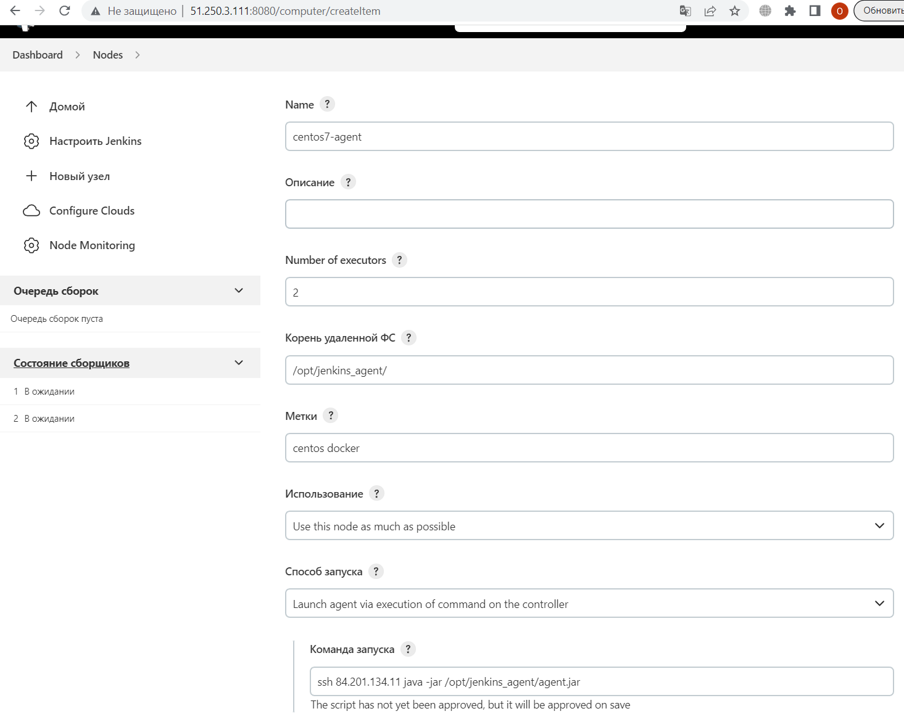
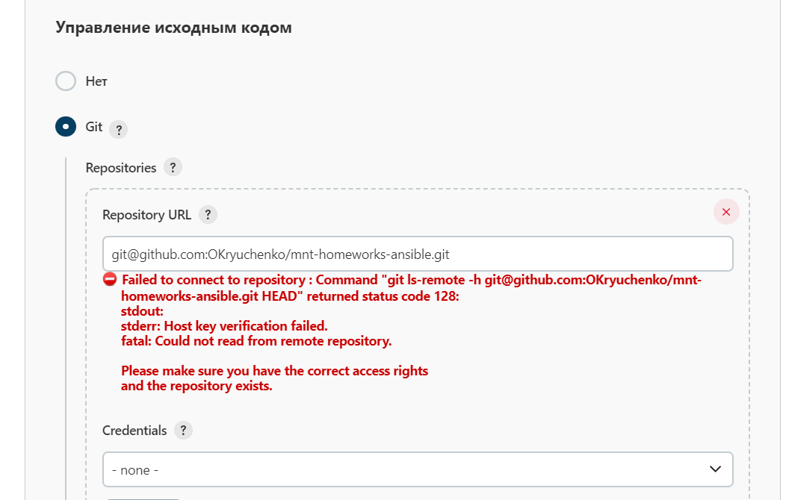
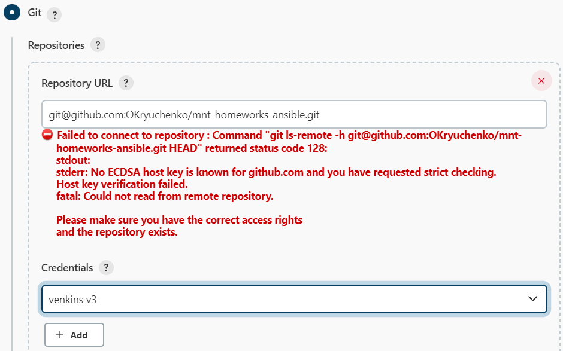
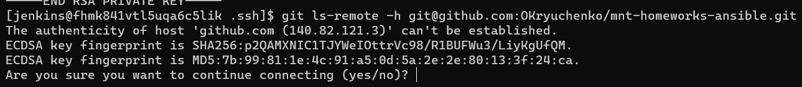
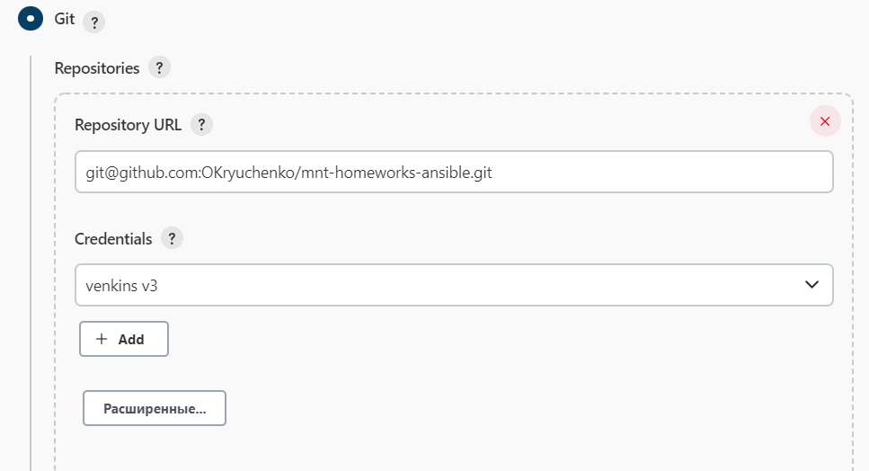

# Домашнее задание к занятию "09.04 Jenkins"

## Подготовка к выполнению

1. Создать 2 VM: для jenkins-master и jenkins-agent.
2. Установить jenkins при помощи playbook'a.
3. Запустить и проверить работоспособность.
http://84.201.135.100:8080/
4. Сделать первоначальную настройку.
sudo cat /var/lib/jenkins/secrets/initialAdminPassword
c5ef7de3ff834d089b7238ad1903dd79
Команда запуска `ssh 84.201.134.11 java -jar /opt/jenkins_agent/agent.jar`

Не принимает ключи с Jenkinsa

` git ls-remote -h git@github.com:OKryuchenko/vector-role.git`
1. меняем пароль для пользователя jenkins
`sudo passwd jenkins` `159633331`
2. переключаемся на польлзоватлея jenkins 
`su jenkins`
3. добавляем публичный ключ в git
`cat ~/.ssh/id_rsa.pub`
4. добавляем закрытый ключ в настройки jenkins
`cat ~/.ssh/id_rsa`
Получаем ошибку

Пробуем с jenkins по ssh подключиться к репозиторию

После успешного подключения, ключ в jenkins тоже работает.

На агенте пришлось тоже прописывать ключи.
 git ls-remote -h git@github.com:OKryuchenko/mnt-homeworks-ansible.git

## Основная часть

1. Сделать Freestyle Job, который будет запускать `molecule test` из любого вашего репозитория с ролью.
2. Сделать Declarative Pipeline Job, который будет запускать `molecule test` из любого вашего репозитория с ролью.
3. Перенести Declarative Pipeline в репозиторий в файл `Jenkinsfile`.
4. Создать Multibranch Pipeline на запуск `Jenkinsfile` из репозитория.
5. Создать Scripted Pipeline, наполнить его скриптом из [pipeline](./pipeline).
6. Внести необходимые изменения, чтобы Pipeline запускал `ansible-playbook` без флагов `--check --diff`, если не установлен параметр при запуске джобы (prod_run = True), по умолчанию параметр имеет значение False и запускает прогон с флагами `--check --diff`.
7. Проверить работоспособность, исправить ошибки, исправленный Pipeline вложить в репозиторий в файл `ScriptedJenkinsfile`.
8. Отправить ссылку на репозиторий с ролью и Declarative Pipeline и Scripted Pipeline.

## Необязательная часть

1. Создать скрипт на groovy, который будет собирать все Job, которые завершились хотя бы раз неуспешно. Добавить скрипт в репозиторий с решением с названием `AllJobFailure.groovy`.
2. Создать Scripted Pipeline таким образом, чтобы он мог сначала запустить через Ya.Cloud CLI необходимое количество инстансов, прописать их в инвентори плейбука и после этого запускать плейбук. Тем самым, мы должны по нажатию кнопки получить готовую к использованию систему.

---

### Как оформить ДЗ?

Выполненное домашнее задание пришлите ссылкой на .md-файл в вашем репозитории.

---
https://plugins.jenkins.io/