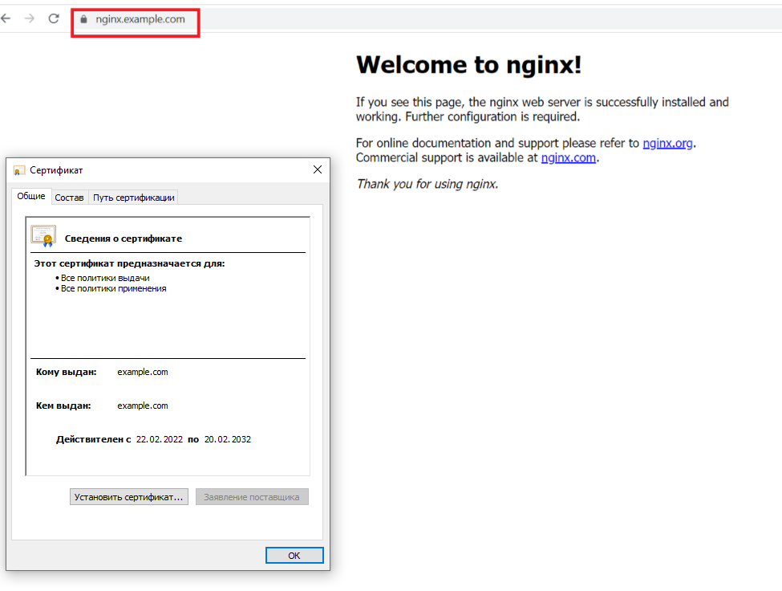

## Процесс установки и настройки ufw
```
$ sudo ufw allow 22/tcp
Rules updated
Rules updated (v6)
$ sudo ufw allow 443/tcp
Rules updated
Rules updated (v6)
$ sudo ufw allow in on lo
Rule added
Rule added (v6)
$ sudo ufw enable
Command may disrupt existing ssh connections. Proceed with operation (y|n)? y
Firewall is active and enabled on system startup
$ sudo ufw status
Status: active

To                         Action      From
--                         ------      ----
22/tcp                     ALLOW       Anywhere
443/tcp                    ALLOW       Anywhere
Anywhere on lo             ALLOW       Anywhere
22/tcp (v6)                ALLOW       Anywhere (v6)
443/tcp (v6)               ALLOW       Anywhere (v6)
Anywhere (v6) on lo        ALLOW       Anywhere (v6)
```

## Процесс установки и выпуска сертификата с помощью hashicorp vault

```
$ sudo apt install jq
$ curl -fsSL https://apt.releases.hashicorp.com/gpg | sudo apt-key add -
OK
```
```
$ sudo apt-add-repository "deb [arch=amd64] https://apt.releases.hashicorp.com $(lsb_release -cs) main"
Hit:1 http://archive.ubuntu.com/ubuntu focal InRelease
Get:2 http://security.ubuntu.com/ubuntu focal-security InRelease [114 kB]
Get:3 https://apt.releases.hashicorp.com focal InRelease [9,495 B]
Get:4 http://archive.ubuntu.com/ubuntu focal-updates InRelease [114 kB]
Hit:5 http://archive.ubuntu.com/ubuntu focal-backports InRelease
Get:6 http://archive.ubuntu.com/ubuntu focal-updates/main i386 Packages [580 kB]
Get:7 https://apt.releases.hashicorp.com focal/main amd64 Packages [41.1 kB]
Get:8 http://archive.ubuntu.com/ubuntu focal-updates/main amd64 Packages [1,434 kB]
Get:9 http://archive.ubuntu.com/ubuntu focal-updates/universe i386 Packages [655 kB]
Get:10 http://archive.ubuntu.com/ubuntu focal-updates/universe amd64 Packages [885 kB]
Fetched 3,832 kB in 1s (3,262 kB/s)
Reading package lists... Done
```
```
$ sudo apt-get update && sudo apt-get install vault
Hit:1 https://apt.releases.hashicorp.com focal InRelease
Hit:2 http://archive.ubuntu.com/ubuntu focal InRelease
Hit:3 http://archive.ubuntu.com/ubuntu focal-updates InRelease
Hit:4 http://archive.ubuntu.com/ubuntu focal-backports InRelease
Get:5 http://security.ubuntu.com/ubuntu focal-security InRelease [114 kB]
Fetched 114 kB in 1s (138 kB/s)
Reading package lists... Done
Reading package lists... Done
Building dependency tree
Reading state information... Done
The following packages were automatically installed and are no longer required:
  linux-image-unsigned-5.4.0-26-generic linux-modules-5.4.0-26-generic shim
Use 'sudo apt autoremove' to remove them.
The following NEW packages will be installed:
  vault
0 upgraded, 1 newly installed, 0 to remove and 7 not upgraded.
Need to get 69.4 MB of archives.
After this operation, 188 MB of additional disk space will be used.
Get:1 https://apt.releases.hashicorp.com focal/main amd64 vault amd64 1.9.2 [69.4 MB]
Fetched 69.4 MB in 3s (26.9 MB/s)
Selecting previously unselected package vault.
(Reading database ... 49689 files and directories currently installed.)
Preparing to unpack .../archives/vault_1.9.2_amd64.deb ...
Unpacking vault (1.9.2) ...
Setting up vault (1.9.2) ...
Generating Vault TLS key and self-signed certificate...
Generating a RSA private key
...............++++
...................++++
writing new private key to 'tls.key'
-----
Vault TLS key and self-signed certificate have been generated in '/opt/vault/tls'.
```
После установки нужно отредактировать конфигурацию сервиса: закомментировать HTTPS listener и раскомментировать HTTP listener
```
$ vi /etc/vault.d/vault.hcl
```
```
ui = true
storage "file" {
  path = "/opt/vault/data"
}
# HTTP listener
listener "tcp" {
  address = "127.0.0.1:8200"
  tls_disable = 1
}
```
Нужно включить и запустить сервис
```
$ sudo systemctl enable vault
$ sudo systemctl start vault
$ export VAULT_ADDR=http://127.0.0.1:8200
```
При первом запуске получаем ключи распечатки и начальный токен root
```
$ vault operator init
export VAULT_ADDR=http://127.0.0.1:8200
Unseal Key 1: N4BoCnja2Y/ZBkO53k+QoSuZcZhUkliQkC0Z5i/bKZ1V
Unseal Key 2: 2cKacsjFaFRrZnUcEwvSv/H7pr/ugoDhlsVT5JpCDEye
Unseal Key 3: 64+jg8Y9v5mbmXZ24TfoiSVc8OlfgFA0NY0vI3gb0X+Z
Unseal Key 4: mCloc9YPtYQBRr/ojRcQxFRWjrUaiHsYu0kdBnWZV+vC
Unseal Key 5: /qftkWF9rC9Ee+DohtuF6phO68sw2He5wz1C+anWZMhW

Initial Root Token: s.T3ZXZcDa093H0q7qDJ1gpIMT
```
Сохраняем ключи и токен в файлах, для распечатки достаточно три ключа
```
sudo vi /root/.vault-keys
N4BoCnja2Y/ZBkO53k+QoSuZcZhUkliQkC0Z5i/bKZ1V
2cKacsjFaFRrZnUcEwvSv/H7pr/ugoDhlsVT5JpCDEye
64+jg8Y9v5mbmXZ24TfoiSVc8OlfgFA0NY0vI3gb0X+Z
```
```
sudo vi /root/.vault-token
s.T3ZXZcDa093H0q7qDJ1gpIMT
```
Для автоматической распечатки подготовлен скрипт
```
sudo vi /usr/local/sbin/unseal.sh
#!/bin/bash
source /etc/default/unseal
for i in `cat /root/.vault-keys`; do vault operator unseal $i; done
vault status >/dev/null 2>&1
if [[ ! $? == "0" ]]
then
  echo "Error unsealing vault"
  exit 1
fi
```
разрешаем запуск скрипта 
```
sudo chmod +x /usr/local/sbin/unseal.sh
```
```
sudo vi /etc/default/unseal
export VAULT_ADDR=http://127.0.0.1:8200
```
Создан юнит-файл, чтобы скрипт запускался при старте системы, но после сервиса vault
```
sudo vi /etc/systemd/system/unseal.service
[Unit]
Description=Unseal vault
After=vault.service

[Service]
Type=oneshot
ExecStart=/usr/local/sbin/unseal.sh

[Install]
WantedBy=multi-user.target
```
Включение и запуск сервиса распечатки
```
sudo systemctl daemon-reload
udo systemctl start unseal
sudo systemctl enable unseal
```
Настройка PKI и выпуск необходимых сертификатов
```
$ export VAULT_TOKEN=s.gQdRbL11wZGDFQnaZilk7InH
$ vault secrets enable pki
Success! Enabled the pki secrets engine at: pki/
$ vault secrets tune -max-lease-ttl=87600h pki
Success! Tuned the secrets engine at: pki/
$ vault write -field=certificate pki/root/generate/internal common_name="example.com" ttl=87600h > CA.crt
$ vault write pki/config/urls issuing_certificates="http://127.0.0.1:8200/v1/pki/ca" crl_distribution_points="http://127.0.0.1:8200/v1/pki/crl"
Success! Data written to: pki/config/urls
$ vault secrets enable -path=pki_int pki
Success! Enabled the pki secrets engine at: pki_int/
$ vault secrets tune -max-lease-ttl=43800h pki_int
Success! Tuned the secrets engine at: pki_int/
$ vault write -format=json pki_int/intermediate/generate/internal common_name="example.com Intermediate Authority" | jq -r '.data.csr' > pki_intermediate.csr
$ vault write -format=json pki/root/sign-intermediate csr=@pki_intermediate.csr format=pem_bundle ttl="43800h" | jq -r '.data.certificate' > intermediate.cert.pem
$ vault write pki_int/intermediate/set-signed certificate=@intermediate.cert.pem
Success! Data written to: pki_int/intermediate/set-signed
$ vault write pki_int/roles/example-dot-com allowed_domains="example.com" allow_subdomains=true max_ttl="744h"
Success! Data written to: pki_int/roles/example-dot-com
$ vault write -format=json pki_int/issue/example-dot-com common_name="nginx.example.com" ttl="744h" > cert.json
```

## Процесс установки и настройки сервера nginx

```
$ sudo apt install nginx
$ sudo vi /etc/nginx/sites-available/ssl.conf
server {
       listen       443 ssl http2 default_server;
       server_name  nginx.example.com;
       root         /var/www/html;

       ssl_certificate "/etc/nginx/ssl/cert.pem";
       ssl_certificate_key "/etc/nginx/ssl/key.pem";
}
$ sudo mkdir /etc/nginx/ssl
$ cat cert.json | jq -r '.data.private_key' > key.pem
$ cat cert.json | jq -r '.data.certificate' > cert.pem
$ cat cert.json | jq -r '.data.issuing_ca' >> cert.pem
$ sudo cp key.pem /etc/nginx/ssl
$ sudo cp cert.pem /etc/nginx/ssl
$ sudo ln -s /etc/nginx/sites-available/ssl.conf /etc/nginx/sites-enabled
$ sudo systemctl start nginx
$ sudo systemctl enable nginx
```

## Страница сервера nginx в браузере хоста не содержит предупреждений




## Скрипт генерации нового сертификата работает

``` 
# vi /usr/local/sbin/certrenew.sh
```
```
#!/bin/bash
export VAULT_ADDR=http://127.0.0.1:8200
export VAULT_TOKEN=$(cat /root/.vault-token)
vault status > /dev/null 2>&1
if [[ $? == "0" ]]
then
  vault write -format=json pki_int/issue/example-dot-com common_name="nginx.example.com" ttl="744h" > /tmp/cert.json
  if [[ $? == "0" ]]
  then 
    cat /tmp/cert.json | jq -r '.data.private_key' > /etc/nginx/ssl/key.pem
    cat /tmp/cert.json | jq -r '.data.certificate' > /etc/nginx/ssl/cert.pem
    cat /tmp/cert.json | jq -r '.data.issuing_ca' >> /etc/nginx/ssl/cert.pem
    systemctl restart nginx
  else
    echo "Error while generating keys"
    exit 1
  fi
else
  echo "There are problems with vault"
  exit 1
fi
```
## Crontab работает

```
 tail /var/log/syslog
Feb 22 19:58:08 vagrant systemd[1]: Reloading.
Feb 22 19:58:59 vagrant vault[23718]: 2022-02-22T19:58:59.544Z [INFO]  core: successful mount: namespace="\"\"" path=pki/ type=pki
Feb 22 19:59:11 vagrant vault[23718]: 2022-02-22T19:59:11.035Z [INFO]  core: mount tuning of leases successful: path=pki/
Feb 22 20:00:34 vagrant vault[23718]: 2022-02-22T20:00:34.711Z [INFO]  core: successful mount: namespace="\"\"" path=pki_int/ type=pki
Feb 22 20:00:43 vagrant vault[23718]: 2022-02-22T20:00:43.984Z [INFO]  core: mount tuning of leases successful: path=pki_int/
Feb 22 20:04:43 vagrant systemd[1]: Reloading.
Feb 22 20:04:44 vagrant systemd[1]: message repeated 2 times: [ Reloading.]
Feb 22 20:17:01 vagrant systemd-udevd[371]: Network interface NamePolicy= disabled on kernel command line, ignoring.
Feb 22 20:17:01 vagrant CRON[24105]: (root) CMD (   cd / && run-parts --report /etc/cron.hourly)
Feb 22 21:17:04 vagrant CRON[24122]: (root) CMD (   cd / && run-parts --report /etc/cron.hourly)
```
```
# crontab -e
40 1 5 * * /usr/local/sbin/certrenew.sh
```