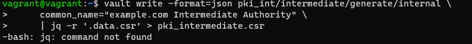
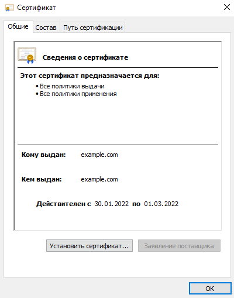

# Курсовая работа по итогам модуля "DevOps и системное администрирование"

Курсовая работа необходима для проверки практических навыков, полученных в ходе прохождения курса "DevOps и системное администрирование".

Мы создадим и настроим виртуальное рабочее место. Позже вы сможете использовать эту систему для выполнения домашних заданий по курсу

## Задание

1. Создайте виртуальную машину Linux.

```
Создал виртуальную машину с помощью Vagrant

```
2. Установите ufw и разрешите к этой машине сессии на порты 22 и 443, при этом трафик на интерфейсе localhost (lo) должен ходить свободно на все порты.

```
sudo ufw allow 22
     Rules updated
     Rules updated (v6)
sudo ufw allow 443
     Rules updated
     Rules updated (v6)
     
sudo ufw enable
sudo ufw status
Status: active

To                         Action      From
--                         ------      ----
22                         ALLOW       Anywhere
443                        ALLOW       Anywhere
22 (v6)                    ALLOW       Anywhere (v6)
443 (v6)                   ALLOW       Anywhere (v6)
```
3. 3.Установите hashicorp vault ([инструкция по ссылке](https://learn.hashicorp.com/tutorials/vault/getting-started-install?in=vault/getting-started#install-vault)).
>curl -fsSL https://apt.releases.hashicorp.com/gpg | sudo apt-key add -   
sudo apt-add-repository "deb [arch=amd64] https://apt.releases.hashicorp.com $(lsb_release -cs) main"   
sudo apt-get update && sudo apt-get install vault
4. Cоздайте центр сертификации по инструкции ([ссылка](https://learn.hashicorp.com/tutorials/vault/pki-engine?in=vault/secrets-management)) и выпустите сертификат для использования его в настройке веб-сервера nginx (срок жизни сертификата - месяц).
>vault server -dev -dev-root-token-id root

другой терминал
```
vagrant@vagrant:~$ export VAULT_ADDR=http://127.0.0.1:8200
vagrant@vagrant:~$ vault status
Key             Value
---             -----
Seal Type       shamir
Initialized     true
Sealed          false
Total Shares    1
Threshold       1
Version         1.9.3
Storage Type    inmem
Cluster Name    vault-cluster-2aea7566
Cluster ID      6331e592-7643-8c5f-447d-5a8aeab32ba9
HA Enabled      false
```
    Генерация сертификата

Enable the pki secrets engine at the pki path.
>vault secrets enable pki

Tune the pki secrets engine to issue certificates with a maximum time-to-live (TTL) 
>vault secrets tune -max-lease-ttl=720h pki

Generate the root certificate and save the certificate in CA_cert.crt
>vault write -field=certificate pki/root/generate/internal \
common_name="example.com" \
ttl=720h > CA_cert.crt
 
Configure the CA and CRL URLs

    vault write pki/config/urls \   
    issuing_certificates="$VAULT_ADDR/v1/pki/ca" \   
    crl_distribution_points="$VAULT_ADDR/v1/pki/crl"

Generate intermediate CA

First, enable the pki secrets engine at the pki_int path.

    vault secrets enable -path=pki_int pki

Tune the pki_int secrets engine to issue certificates with a maximum time-to-live (TTL) of 720 hours.

    vault secrets tune -max-lease-ttl=720h pki_int

Execute the following command to generate an intermediate and save the CSR as pki_intermediate.csr

    vault write -format=json pki_int/intermediate/generate/internal \
    common_name="example.com Intermediate Authority" \
    | jq -r '.data.csr' > pki_intermediate.csr

Получил ошибку

Установил jq

sudo apt install jq
vault write -format=json pki/root/sign-intermediate csr=@pki_intermediate.csr      format=pem_bundle ttl="720h"      | jq -r '.data.certificate' > intermediate.cert.pem
vault write pki_int/intermediate/set-signed certificate=@intermediate.cert.pem
Create a role named example-dot-com which allows subdomains.
>vault write pki_int/roles/example-dot-com \
     allowed_domains="example.com" \
     allow_subdomains=true \
     max_ttl="720h"ls
vault write pki_int/issue/example-dot-com common_name="test.example.com" ttl="24h"

6. Установите корневой сертификат созданного центра сертификации в доверенные в хостовой системе.


_____

_____

8. Установите nginx.
9. По инструкции ([ссылка](https://nginx.org/en/docs/http/configuring_https_servers.html)) настройте nginx на https, используя ранее подготовленный сертификат:
- можно использовать стандартную стартовую страницу nginx для демонстрации работы сервера;
- можно использовать и другой html файл, сделанный вами;
```
sudo nano /etc/nginx/nginx.conf
...
http {
...
  server {
      listen              443 ssl;
      server_name         test.example.com;
      ssl_certificate     /etc/ssl/example.crt;
      ssl_certificate_key /etc/ssl/example.key;

sudo nginx -t
```
10. Откройте в браузере на хосте https адрес страницы, которую обслуживает сервер nginx.
11. Создайте скрипт, который будет генерировать новый сертификат в vault:
- генерируем новый сертификат так, чтобы не переписывать конфиг nginx;
- перезапускаем nginx для применения нового сертификата.
12. Поместите скрипт в crontab, чтобы сертификат обновлялся какого-то числа каждого месяца в удобное для вас время.

## Результат

Результатом курсовой работы должны быть снимки экрана или текст:

- Процесс установки и настройки ufw
- Процесс установки и выпуска сертификата с помощью hashicorp vault
- Процесс установки и настройки сервера nginx
- Страница сервера nginx в браузере хоста не содержит предупреждений
- Скрипт генерации нового сертификата работает (сертификат сервера ngnix должен быть "зеленым")
- Crontab работает (выберите число и время так, чтобы показать что crontab запускается и делает что надо)

## Как сдавать курсовую работу

Курсовую работу выполните в файле readme.md в github репозитории. В личном кабинете отправьте на проверку ссылку на .md-файл в вашем репозитории.

Также вы можете выполнить задание в [Google Docs](https://docs.google.com/document/u/0/?tgif=d) и отправить в личном кабинете на проверку ссылку на ваш документ.
Если необходимо прикрепить дополнительные ссылки, просто добавьте их в свой Google Docs.

Перед тем как выслать ссылку, убедитесь, что ее содержимое не является приватным (открыто на комментирование всем, у кого есть ссылка), иначе преподаватель не сможет проверить работу.
Ссылка на инструкцию [Как предоставить доступ к файлам и папкам на Google Диске](https://support.google.com/docs/answer/2494822?hl=ru&co=GENIE.Platform%3DDesktop).

